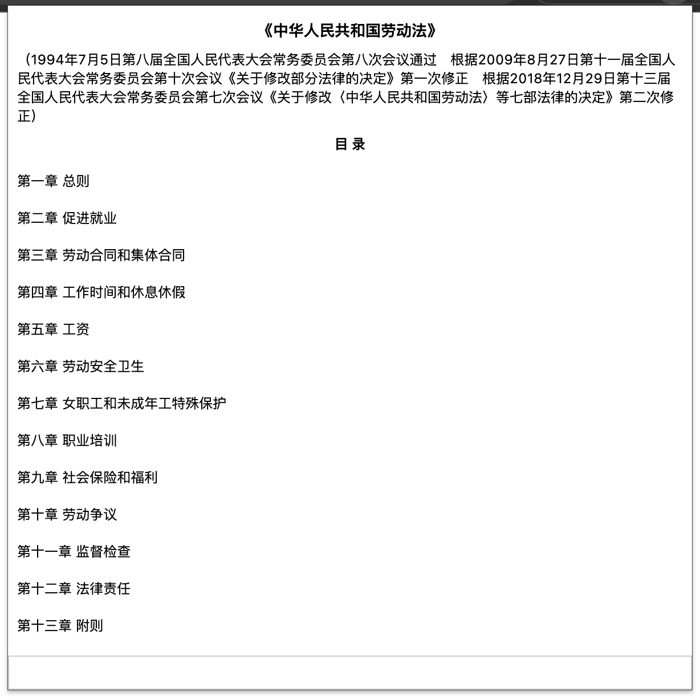
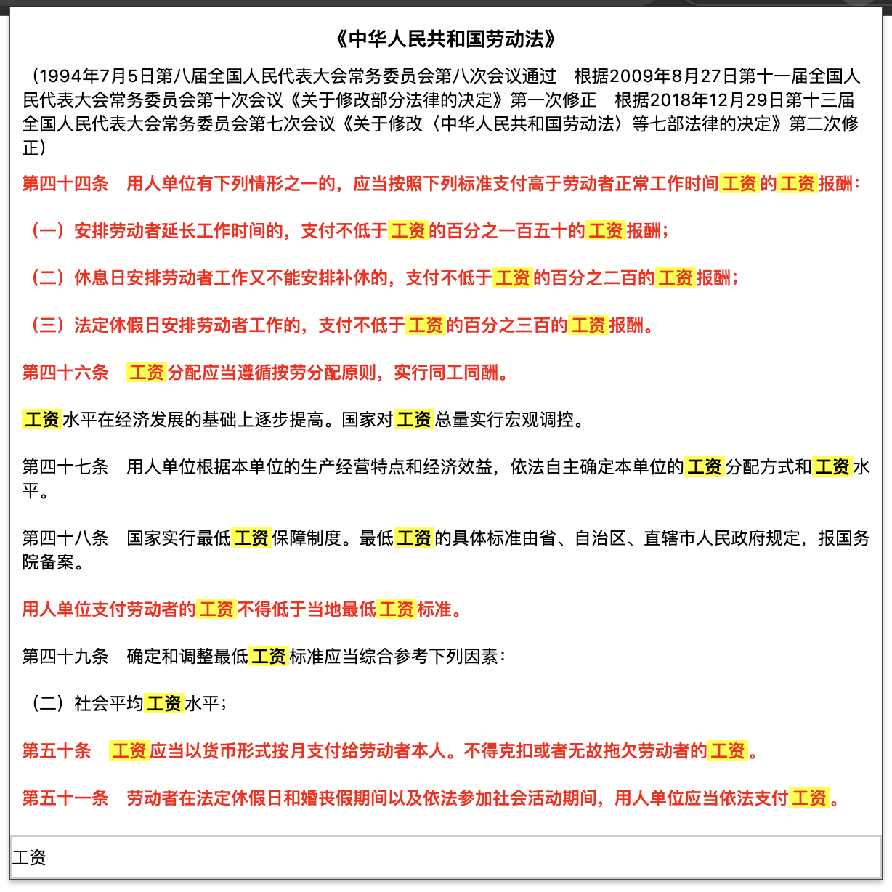
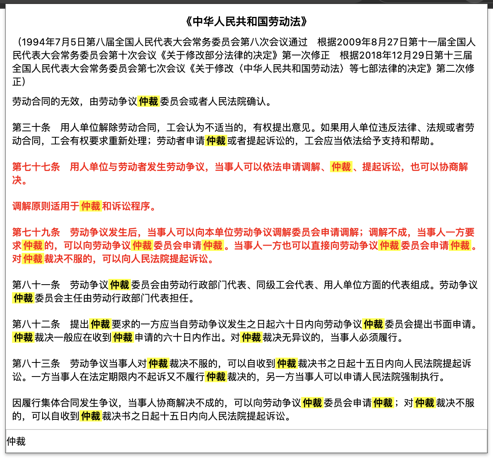

# 劳动法助手浏览器插件

该项目仅用于学习目的。

## 简介

劳动法助手是一款专为劳动者和雇主设计的浏览器插件，旨在提供即时的劳动法咨询和帮助。它集成了劳动法的基本知识、常见问题解答和法律条款查询功能。

## 安装

github最新下载地址：[release v1.1.2](https://github.com/SmallTeddy/labor-law/releases/tag/release-v1.1.2)

chrome 应用商店下载地址 [release v1.1.2](https://chromewebstore.google.com/detail/labor-law/dgecpjicgonehpkboihcbnmjnggcgohk)

## 功能特点

* **即时查询**：一键查询劳动法相关条款和规定。
* **法规更新**：实时更新劳动法的最新变动和解释。

## 安装指南

1. 打开Chrome浏览器。
2. 访问 [Chrome网上应用店](https://chrome.google.com/webstore)。
3. 搜索“labor-law”或直接访问插件页面链接。
4. 点击“添加至Chrome”按钮进行安装。

## 使用方法

* 点击浏览器工具栏上的插件图标。
* 在弹出的界面中选择所需的服务或输入查询关键词。
* 查看查询结果或进一步操作。

## 支持版本

* 适用于Chrome浏览器的所有最新版本。

## 版权声明

* 本插件所提供的所有信息仅供参考，具体法律问题请咨询专业律师。
* 版权所有 © 2024 SmallTeddy。保留所有权利。

请在遵守当地法律法规的前提下使用本插件。

## 默认展示

## 检索功能

