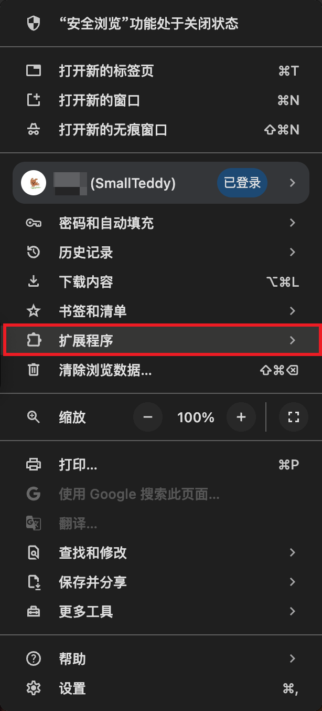
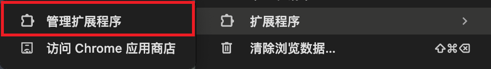
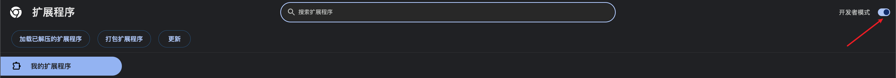

# Labor Law

该项目仅用于学习目的。

## 下载

github最新下载地址：[release v1.1.1](https://github.com/SmallTeddy/labor-law/releases/tag/release-v1.1.1)

chrome 应用商店下载地址 [release v1.1.2](https://chromewebstore.google.com/detail/labor-law/dgecpjicgonehpkboihcbnmjnggcgohk)

## 使用方法

### 1、找到拓展程序

### 2、点击管理控制程序

### 3、打开开发者模式

### 4、加载已解压的拓展程序

### 5、选择已经解压的文件包

### 6、打开拓展列表

### 7、点击 Labor Law 进行使用

## 默认展示

## 检索功能

